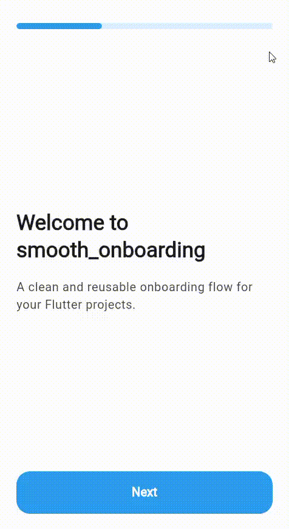

# smooth_onboarding

`smooth_onboarding` is a reusable Flutter onboarding package designed for pub.dev.
It focuses on a clean first-run experience, shared-axis page motion, dark mode adaptation,
and an API that stays easy to integrate in real apps.



## Preview

See it in action: the example app uses built-in shapes and icons to stay lightweight while providing a sleek, smooth onboarding experience.

## Features

- Animated progress bar with page-based progress.
- Optional back button that appears from the second page onward.
- Floating primary button that changes from `Next` to `Get started` on the last page.
- First-launch persistence via `SharedPreferences`.
- Dark mode aware default styling.
- Fully customizable page content with any widget.
- Customizable labels (`next`, `done`, `back` tooltip).
- Optional back button toggle (`showBackButton`).
- Configurable animation durations and progress semantics label.
- Configurable page transition style: horizontal slide (default), shared-axis, or fade.
- Modern completion animation that slides the whole screen upward.
- External reload trigger for programmatic onboarding reset.

## Installation

```yaml
dependencies:
  smooth_onboarding: ^0.1.0
```

## Usage

```dart
import 'package:flutter/material.dart';
import 'package:smooth_onboarding/smooth_onboarding.dart';

class AppRoot extends StatelessWidget {
  const AppRoot({super.key});

  @override
  Widget build(BuildContext context) {
    return MaterialApp(
      home: OnboardingGate(
        storageKey: OnboardingStorage.defaultStorageKey,
        pages: const [
          OnboardingPage(
            title: 'Welcome',
            body: Text('Discover the app in a few steps.'),
          ),
          OnboardingPage(
            title: 'Customize',
            body: Icon(Icons.palette_outlined, size: 72),
          ),
          OnboardingPage(
            title: 'Ready',
            body: Text('Initial setup is complete.'),
          ),
        ],
        child: const Scaffold(
          body: Center(child: Text('Main app content')),
        ),
      ),
    );
  }
}
```

If you want to control the first-launch check yourself, use `OnboardingStorage`:

```dart
final showOnboarding = await OnboardingStorage.shouldShowOnboarding();
if (showOnboarding) {
  // Show onboarding.
}
```

## Customization

You can customize texts, colors and layout through page data, labels and theme:

```dart
OnboardingGate(
  pages: pages,
  showBackButton: true,
  nextButtonLabel: 'Next',
  doneButtonLabel: 'Get started',
  backButtonTooltip: 'Back',
  progressSemanticsLabel: 'Onboarding progress',
  progressAnimationDuration: const Duration(milliseconds: 360),
  contentAnimationDuration: const Duration(milliseconds: 300),
  contentAnimationCurve: Curves.easeOutCubic,
  pageTransitionType: OnboardingPageTransitionType.slideHorizontal,
  buttonLabelAnimationDuration: const Duration(milliseconds: 240),
  closeAnimationDuration: const Duration(milliseconds: 420),
  closeAnimationCurve: Curves.easeInCubic,
  theme: const OnboardingTheme(
    backgroundColor: Colors.white,
    progressColor: Colors.blue,
    buttonColor: Colors.blue,
    progressHeight: 8,
  ),
  child: const HomePage(),
)
```

Reset + force gate re-check:

```dart
await OnboardingStorage.reset();
setState(() {
  reloadToken++;
});
```

Then pass `reloadTrigger: reloadToken` to `OnboardingGate`.

## Example behavior

The package is designed around these defaults:

- White background in light mode.
- Dark gray background in dark mode.
- Blue progress bar and blue primary button.
- Horizontal slide transitions between pages (no fade).
- Full-screen close animation that moves the onboarding upward.
- Small back arrow with a compact hit area.

## Development

For local checks, run the usual Flutter commands from the package root:

```bash
flutter analyze
flutter test
```

## License

MIT
